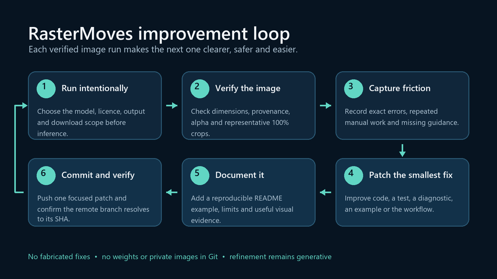

# RasterMoves

[](https://kieransimkin.co.uk/danceflow/)

By **[Kieran Simkin](https://kieransimkin.co.uk/)** · [DanceFlow ecosystem](https://kieransimkin.co.uk/danceflow/) · [Vector logo and usage guide](docs/branding/README.md).

Local image upscaling with PyTorch/ONNX model plugins and optional refinement. https://kieransimkin.co.uk/


A modular Python CLI and library for **local image upscaling with OpenModelDB models**.
Each model is an independent plugin, normally a small JSON manifest. Shared PyTorch/Spandrel
and ONNX Runtime backends handle architecture loading and inference. Weights are fetched
from the model's recorded sources only when needed, verified, and cached for later use.

**Version:** 0.3.2. Distribution name: `rastermoves`. See [release setup](docs/RELEASING.md)
for PyPI, TestPyPI, GitHub Releases and container publishing.
It is an independent implementation, not an official OpenModelDB product.

## Part of DanceFlow

**RasterMoves** is the image-upscaling and enhancement component of the DanceFlow
family, alongside **KeywordMoves**, **StemLab**, **DanceMoves**, and **DanceRudiments**.
It runs as a standalone Python library or command-line tool; it does not require those
other components to be installed. The package, Python import, and executable all use
`rastermoves`.

Version 0.1.1 renamed the original UpscaleLab package. See the
[migration guide](docs/MIGRATION.md) for import, command, plugin, environment-variable,
and existing-cache changes, and the [changelog](CHANGELOG.md) for release details.

## Install

Python 3.10 or newer is required; Python 3.11 or 3.12 is a practical choice for broad
runtime wheel availability. Extract the source archive and run these commands inside
its `rastermoves` directory:

```bash
python -m venv .venv
# Linux / macOS:
source .venv/bin/activate
# Windows PowerShell, instead:
# .venv\Scripts\Activate.ps1

python -m pip install --upgrade pip
python -m pip install -e ".[torch,onnx,gdrive]"
rastermoves --version
rastermoves doctor
```

This installs the two inference backends and optional Google Drive downloader. For a
smaller installation, choose only the required extras:

```bash
python -m pip install -e ".[torch]"        # PyTorch / Spandrel
python -m pip install -e ".[onnx]"         # ONNX Runtime CPU, without PyTorch
python -m pip install -e .                # Catalogue and downloads only
```

For NVIDIA acceleration, first install matching PyTorch and torchvision builds using
the [official PyTorch installer](https://pytorch.org/get-started/locally/), then install
this project's `torch` extra. The ONNX CUDA alternative is `.[onnx-gpu]`; **do not
install `onnxruntime` and `onnxruntime-gpu` together**. CUDA/cuDNN compatibility is governed
by the chosen runtime. PyTorch also supports Apple MPS when that device is available.
`doctor` reports the runtimes and devices it can actually discover.

For a complete NVIDIA development environment after installing the matching CUDA
PyTorch build, install every compatible optional feature explicitly. This uses the GPU
ONNX runtime instead of the conflicting CPU package:

```powershell
python -m pip install -e ".[torch,onnx-gpu,refine,trace,gdrive,extra-arches,dev]"
python -m pip check
rastermoves doctor
python -m pytest -q
```

This path was verified on 3 October 2026 with Python 3.13.14, PyTorch
2.14.1+cu126, torchvision 0.29.1+cu126, ONNX Runtime GPU 1.30.0,
Diffusers 0.35.2 and an NVIDIA RTX 4060 Ti. `doctor` found CUDA through PyTorch
and TensorRT/CUDA/CPU ONNX providers; the local suite passed 347 tests with five
explicitly opt-in pretrained/download tests skipped. These versions describe that
verified environment, not a universal lockfile. Model weights are still downloaded
on demand and retain their own licences and storage requirements.

Dependencies have compatibility floors, not a lockfile. Keep inference dependencies
updated, especially PyTorch. The core local tests were run on Python 3.13.5; that does
not imply all optional third-party runtimes were installed or tested on that version.

## Compare every model

```bash
# All registered models: bundled, previously synced, and your custom plugins.
rastermoves upscale input.png --all-models -o comparison

# Refresh the full OpenModelDB catalogue first, then attempt every entry.
rastermoves upscale input.png --all-models --sync-models -o full-comparison

# Inspect the planned models, licences and filenames without downloading weights.
rastermoves upscale input.png --all-models --sync-models --dry-run -o full-comparison

# Retry failures/interrupted models; reuse only checksum-verified matching results.
rastermoves upscale input.png --all-models --resume -o full-comparison
```

Each model runs sequentially and is released before the next one. Successful models
produce `model-MODEL_ID.png` and a provenance sidecar. `summary.json` records every
selected model's success, failure or interruption and is updated as the run proceeds.
Failures do not stop later models; the command exits **1** if any model fails, **130**
on Ctrl+C, or **0** when all models succeed or are reused.

`--all-models` by itself does **not** refresh metadata or secretly download the entire
remote catalogue. Add `--sync-models` (or run `rastermoves sync`) for that. A fresh
installation knows eight model plugins. Full-catalogue comparisons can download many
large checkpoints. Catalogue membership is not a guarantee of runtime compatibility:
unsupported architectures, unavailable hosts and missing runtimes are recorded as
failures, not presented as successful results. Each model's licence still applies.

Use a new output folder, `--resume`, or `--overwrite` explicitly. Standard tile,
precision, device, final-size, format, alpha, offline and checksum options also apply.
One device and precision apply to the whole sweep. If only particular models reject
that combination, keep the original `summary.json` and rerun those model IDs into a
separate folder with compatible settings and the same final-size option; changing
device or precision is not a valid `--resume` of the original comparison.
See [all-model comparisons](docs/ALL_MODELS.md) for details and resume boundaries.

## Optional generative detail refinement

RasterMoves can now **upscale, then refine at the same dimensions**, or refine an
already enlarged image. The independent `sd15-tile` and `sdxl-tile` workflows use
ControlNet Tile with image-to-image diffusion. This synthesises plausible detail;
it is **not verified recovery of information**. Refinement is always opt-in on
`upscale`. Ordinary upscaling, model IDs and existing defaults are unchanged.

```bash
# Add the separate diffusion extra. Install the appropriate PyTorch build for your hardware.
python -m pip install -e ".[refine,trace]"

rastermoves refiners
rastermoves upscale input.png -o enhanced.png --refiner sd15-tile --seed 123 --trace
rastermoves refine already-upscaled.png -o enhanced.png --refiner sdxl-tile --seed 123

# White mask pixels protect lettering/faces; mask dimensions must match the working image.
rastermoves refine already-upscaled.png -o enhanced.png --protect-mask protected.png

# Preview without weight downloads, or resume a verified result / interrupted workflow.
rastermoves refine already-upscaled.png -o enhanced.png --dry-run
rastermoves refine already-upscaled.png -o enhanced.png --resume
```

Every workflow saves **`enhanced.baseline.png`** and its report before attempting
refinement, plus **`enhanced.png.json`** with component revisions, checksums, seeds,
parameters and actual denoising-step counts. Failed refinement preserves the baseline;
`--resume` verifies hashes and can reuse it. Outputs must be lossless PNG/WebP/TIFF.
Transparency is retained and fully protected pixels are restored from the baseline.

Weights are **multi-gigabyte, first-use downloads**, pinned to specific Hugging Face
commits. No repository Python code is downloaded/executed. The SD1.5 Tile checkpoint
uses restricted tensor-only loading; other components require safetensors. Full-precision
files are downloaded and cast for inference; low GPU precision does not reduce download
size. Component licences apply separately. `--offline` requires all pinned files cached.

`--refine-tile` and `--refine-overlap` control diffusion independently of existing
upscaler tiles. On CUDA, `--refine-offload model` trades speed for reduced resident GPU
memory. Existing `--trace` records refinement stages, with CUDA allocator peaks included
in refinement reports when applicable. CPU/MPS routes exist but hardware performance is
not promised. Tiling bounds inference work, not total output-buffer RAM.

The heavy `refine` extra is intentionally **not part of `all`, default dependencies,
or the default CPU container**. Use `.[all,refine]` explicitly for both toolsets.
`upscale --all-models --refiner sd15-tile` applies just that refiner to every selected
upscaler; there is no implicit refiner/seed cross product. See the
[complete refinement guide](docs/REFINEMENT.md) for presets, masks, caching, resume,
plugins, test limitations, and the Python API.

## Timing and resource traces

```bash
python -m pip install -e ".[trace]"  # Also included in .[all] and .[dev]

# A single image: output.png.trace.json (a new numbered file if it already exists).
rastermoves upscale input.png -o output.png --trace

# One timeline for an entire model comparison, with per-model metrics in summary.json.
rastermoves upscale input.png --all-models -o comparison --trace

# Named trace; --trace-file enables recording even without --trace.
rastermoves upscale input.png -o output.png --trace-file timings/run-01.json --trace-interval 0.1
```

Traces contain wall time, process CPU time/utilization, resident/virtual memory and
thread counts, plus system available-memory context. Timed stages distinguish model
loading, downloads/cache verification, inference, postprocessing and output writing.
Open the **Chrome JSON** trace in [Perfetto](https://ui.perfetto.dev/) to inspect the
stage timeline alongside resource counters, or read the JSON directly. A concise
run summary is printed to stderr. Batch/all-model defaults are `OUTPUT_DIR/trace.json`.

This is **process-level sampling**, not GPU profiling or exact allocation tracking:
100% CPU means one logical CPU, multi-core use can exceed 100%, and memory peaks are
sampled estimates that include runtime/allocator memory. Tracing is off by default;
no sampler, trace files or psutil import are used until enabled. See the
[tracing guide](docs/PROFILING.md) for fields, limitations, failure handling, resume and
Python API usage.

## First upscale

```bash
rastermoves upscale input.png -o output.png
```

The default plugin is `4x-realesr-general-x4v3`. The first run fetches its weights;
subsequent runs use the verified cache. Images are processed locally and are not
uploaded to the model host. By default, inference is FP32 and automatically selects
CUDA, then MPS, then CPU for PyTorch; ONNX selects CUDA when available, otherwise CPU.

```bash
# Explicit model and CUDA device; save a provenance sidecar
rastermoves upscale input.png -o output.png -m 4x-realesrgan-x4plus --device cuda --report

# A Hugging Face-hosted model (review its non-commercial licence)
rastermoves upscale input.png -o sharp.png -m 4x-UltraSharpV2

# An ONNX-only starter model
rastermoves upscale input.png -o span.png -m 4x-SPANkendata --backend onnx --device cpu

# Resize to a particular width AFTER the native neural upscale
rastermoves upscale cover.png -o cover-3000.png --width 3000

# Batch processing, including subdirectories; retain transparency in PNG output
rastermoves upscale ./originals -o ./upscaled --recursive --report
```

`--scale`, `--width`, `--height`, and `--long-edge` specify the final size while preserving
aspect ratio. Only one may be selected. The neural model still runs at its native
integer scale; a final Lanczos resize produces the requested size. Targets larger
than native scale emit a warning: the extra enlargement is not another neural pass.

## Model plugins and the OpenModelDB catalogue

Eight independently addressable manifests are bundled. No weights are included.
The licence and source details below were transcribed from OpenModelDB; consult the
linked record and original author before using or redistributing a model.

| Plugin ID | Native scale | Architecture / format | Recorded model licence |
| --- | --- | --- | --- |
| [4x-realesr-general-x4v3](https://openmodeldb.info/models/4x-realesr-general-x4v3) | 4x | Compact / PTH | BSD-3-Clause |
| [4x-realesr-animevideo-v3](https://openmodeldb.info/models/4x-realesr-animevideo-v3) | 4x | Compact / PTH | BSD-3-Clause |
| [4x-realesrgan-x4plus](https://openmodeldb.info/models/4x-realesrgan-x4plus) | 4x | ESRGAN / PTH | BSD-3-Clause |
| [4x-UltraSharpV2](https://openmodeldb.info/models/4x-UltraSharpV2) | 4x | DAT / safetensors, ONNX | CC-BY-NC-SA-4.0 |
| [4x-Remacri](https://openmodeldb.info/models/4x-Remacri) | 4x | ESRGAN / PTH | CC-BY-NC-SA-4.0 |
| [4x-SPANkendata](https://openmodeldb.info/models/4x-SPANkendata) | 4x | SPAN / ONNX | CC-BY-SA-4.0 |
| [4x-LexicaHAT](https://openmodeldb.info/models/4x-LexicaHAT) | 4x | HAT / PTH | CC-BY-4.0 |
| [2x-NomosUni-span-multijpg](https://openmodeldb.info/models/2x-NomosUni-span-multijpg) | 2x | SPAN / PTH, Google Drive | CC-BY-4.0 |

```bash
rastermoves models
rastermoves models --tag photo
rastermoves models --architecture span --scale 2
rastermoves info 4x-UltraSharpV2

# Import the current catalogue metadata, not every model's weights
rastermoves sync
rastermoves models --json > catalogue.json
```

`sync` consumes OpenModelDB's exported JSON catalogue, with its official repository
archive as a fallback. Every valid model entry becomes a separate data-driven plugin.
The importer retains its architecture, channels, native scale, tags, source URLs,
formats, byte sizes, and checksums. Unsupported formats remain visible rather than
being mislabeled as runnable. The catalogue endpoint and remote downloads were not exercised in this release
validation; local schema and fallback fixtures were tested.

For an unbundled model, pass the exact OpenModelDB ID or model-page URL. It is fetched
individually on first use, without requiring a full sync:

```bash
rastermoves info https://openmodeldb.info/models/4x-LexicaHAT
rastermoves upscale input.png -o output.png -m https://openmodeldb.info/models/4x-LexicaHAT

# Import from a local OpenModelDB checkout, useful offline or with a pinned revision
rastermoves sync --source /path/to/open-model-database/data/models --offline
```

**Catalogue coverage is not universal inference compatibility.** A model must have a
supported resource, a working source, and an architecture understood by the installed
backend. New architectures, unsupported hosts, face-alignment workflows, multi-input
models, video models, and archive-only packages can require an additional plugin.
No remote repository Python code is loaded or installed automatically.

## Downloads, verification and offline use

Hugging Face sources use `huggingface_hub.hf_hub_download`. Other supported sources
include GitHub releases/raw files and ordinary HTTPS file links. Individual Google
Drive file links use the optional `gdrive` extra. Listed mirrors are tried in order
of provider preference: Hugging Face, direct HTTPS, then Google Drive. It does not
search for similarly named models and silently substitute third-party weights.

```bash
rastermoves download 4x-realesr-general-x4v3 --strict-checksums
rastermoves upscale input.png -o output.png --offline

# Global flags go BEFORE the subcommand
rastermoves --cache-dir ./model-cache download 4x-UltraSharpV2 --backend spandrel
rastermoves --cache-dir ./model-cache upscale input.png -o output.png -m 4x-UltraSharpV2 --offline
```

Defaults use platform-specific user cache/config directories. `RASTERMOVES_CACHE`
overrides the cache; `RASTERMOVES_OFFLINE=1` disables network use through the tool.
The cache contains `weights`, `huggingface`, `catalog.json`, and `imported-models` as
needed. Hugging Face's own cache and the verified weight copy can consume duplicate
disk space. Once the verified copy exists, inference needs only that copy.

A publisher SHA-256, when supplied, is checked on every cache use. Files without a
publisher checksum get a local integrity receipt, which detects later corruption
but does not authenticate their origin. `--strict-checksums` rejects those files.
Partial or failed downloads are not published as complete cached weights; file locks
protect concurrent writes. The tool rejects HTML error pages and Git LFS pointers.
A checksum mismatch is an error, not permission to use the changed file.

Use `HF_TOKEN` for a Hugging Face account when necessary. The token is handled by the
Hub library, never attached to arbitrary HTTP model sources. Public models usually
do not require an account. Gated models may require accepting their terms first.

Mega links, pCloud share pages, Drive folders, and compressed archive resources are
not automatically resolved. Download those manually through their normal provider,
then use a local file:

```bash
rastermoves upscale input.png -o output.png --model-file /path/to/model.safetensors
rastermoves upscale input.png -o output.png --model-file /path/to/model.onnx --native-scale 4
```

Adding `-m MODEL_ID` to a local-file run verifies matching manifest checksums and
metadata when available. Standalone local ONNX defaults to RGB NCHW; nonstandard
layout/channel contracts need a manifest. TorchScript is deliberately unsupported.

## Memory, tiling and image handling

```bash
# Smaller tiles to reduce inference VRAM requirements
rastermoves upscale input.png -o output.png --tile 128 --overlap 24 --tile-pad 16

# Whole-image inference, when memory permits
rastermoves upscale input.png -o output.png --tile 0

# CUDA half precision only for PyTorch models that explicitly support it
rastermoves upscale input.png -o output.png --device cuda --precision fp16
```

Tiles overlap and are feather-blended, with an additional context halo to reduce
boundary artifacts. Sizes are in input-image pixels. Overlap must be smaller than
the tile size. Spandrel's descriptor handles model-specific input padding and cropping;
ONNX constraints can be supplied in a manifest. GPU out-of-memory failures during
supported tiled inference trigger smaller-tile retries. Model loading failures and
host RAM exhaustion do not receive that recovery.

Global-context models can behave differently on tiles. The tool respects a Spandrel
model's discouraged/internal tiling guidance and runs a whole-image pass unless
`--force-tiling` is supplied. That override may trade image consistency for lower VRAM.
There is no promise that feathering eliminates every neural-model boundary artifact.

Tiling limits inference VRAM, **not total output RAM**. Native-scale results are
accumulated in host memory before final resizing. The default native AND final output
limit is 64 megapixels; increase `--max-output-mp` only with sufficient memory. A
3000x3000 input at 4x produces a 144-megapixel intermediate even when the final target
is 3000 pixels wide, so it exceeds the default limit. The float RGB accumulation
buffer plus weights alone uses about 16 bytes per native output pixel, before other
arrays, inference workspaces and encoded output.

Input PNG, JPEG, WebP, BMP and TIFF are supported via Pillow. Output supports PNG,
lossless WebP, JPEG quality 95 and TIFF. The pipeline applies EXIF orientation and
converts embedded profiles to sRGB. Alpha is handled separately using Lanczos by
default; `--alpha model` sends the alpha channel through the model too. Transparent
JPEG output is rejected rather than silently flattened. Input files are never
replaced in place; overwriting an existing destination requires `--overwrite`.

This version is an **8-bit still-image tool**. HDR/high-bit-depth input, animated
images and multi-page inputs are rejected. EXIF metadata is intentionally not copied:
orientation has been applied and stale dimensions/GPS fields are omitted. Neural
upscaling can invent or alter detail; it is not forensic reconstruction.

## Python API

```python
from rastermoves import Upscaler

with Upscaler("4x-realesr-general-x4v3", device="auto") as upscaler:
    upscaler.upscale_file(
        "input.png", "output.png",
        tile=256, overlap=32, tile_pad=16,
        report=True,
    )
    print(upscaler.last_report)
```

The same session can process many images without reloading the model. `upscale_image`
accepts and returns a Pillow image. Sessions are not thread-safe; use separate sessions
or external serialization. See `examples/batch_api.py` and [the plugin guide](docs/PLUGINS.md).

## Agent skill: use and improve RasterMoves

The repository includes the discoverable
[`$use-and-improve-rastermoves`](.agents/skills/use-and-improve-rastermoves/SKILL.md)
skill for image-upscaling work. It wraps the existing CLI and API guidance in a
continuous improvement loop: verify the image and provenance, capture friction from
the real run, make the smallest reusable improvement, test it, document it here, then
commit and verify the focused patch on GitHub.



The loop keeps image results and reusable tool changes connected without committing
private inputs, model weights or unsupported claims.

Example requests:

```text
Use $use-and-improve-rastermoves to upscale this cover to 3000 pixels wide, preserve
transparency, verify the output, and improve any reusable part of the workflow you find.

Use $use-and-improve-rastermoves to compare suitable photo models on this image, explain
the visible trade-offs, and turn the clearest workflow gap into a tested patch.
```

Each resulting improvement adds a concise reproducible command or API example to this
README. Add a labelled before/after screenshot or equal-coordinate 100% crops under
`docs/assets/` only when they materially demonstrate a visual change, comparison, or
diagnostic; text-only changes and private source images do not need screenshots. The
skill's [evaluation checklist](.agents/skills/use-and-improve-rastermoves/references/evaluation-checklist.md)
defines the evidence, visual checks, and screenshot standard.

The skill does not make generative detail factual, waive model licences, permit private
inputs to be committed, or turn a local commit into proof that GitHub received it.

## Validation and development

```bash
python -m pip install -e ".[dev]"
python -m pytest -q

# Download and run two actual small models: requires both runtimes and network access
python -m pip install -e ".[torch,onnx,dev]"
# Linux / macOS:
RASTERMOVES_LIVE=1 python -m pytest -q tests/test_live.py
# Windows PowerShell, instead:
# $env:RASTERMOVES_LIVE = "1"
# python -m pytest -q tests/test_live.py
```

The supplied local verification covers cache integrity, catalogue parsing, safe
checkpoint loading, image processing, tiled inference, backend contracts and CLI
behavior. **Real pretrained-model smoke tests were not run in the build environment**,
where the Spandrel and ONNX runtimes are not installed. This rename validation
did not download weights or attempt live pretrained inference.
See [TESTING.md](docs/TESTING.md) for the exact results and distinctions between real
PyTorch operations, stubbed adapters, and unrun live integrations.

```bash
python -m build
```

A GitHub Actions workflow is included for offline tests and an opt-in manual live
smoke-test job. No repository was created and no release was published automatically.

## Licence and references

Project source: GPL-3.0-only. Model weights retain their own licences and are not
included or relicensed. In particular, UltraSharpV2 and Remacri are recorded as
non-commercial models. A model being downloadable does not grant commercial rights.
Review the creator's terms separately. See `LICENSE`, `THIRD_PARTY_NOTICES.md`,
[SECURITY.md](docs/SECURITY.md), and [SOURCES.md](docs/SOURCES.md).

## Automated releases and containers

The [Release workflow](.github/workflows/release.yml) tests the tagged source, builds
and validates its wheel/source distribution, then publishes to **PyPI**, **GitHub
Releases**, and **GHCR**. **TestPyPI** and a **Docker Hub** mirror are optional.
Configure Trusted Publishing once, then push a tag matching both version declarations:

```bash
git tag -a v0.2.0 -m "RasterMoves 0.2.0"
git push origin v0.2.0
```

Production uploads do not run on ordinary branch pushes or pull requests. The
repository must contain the workflow at the tagged commit. See
[RELEASING.md](docs/RELEASING.md) for exact setup fields, first-release instructions,
TestPyPI rehearsals, failure recovery, and Docker commands. Neither the wheel nor the
container includes pretrained weights; they download on demand. The supplied
`linux/amd64` container includes CPU PyTorch/Spandrel and ONNX Runtime; GPU use remains
available through the native Python installation.

After a successful production publication:

```bash
python -m pip install "rastermoves[all]"
docker run --rm ghcr.io/kieransimkin/rastermoves:0.2.0 --version
```
